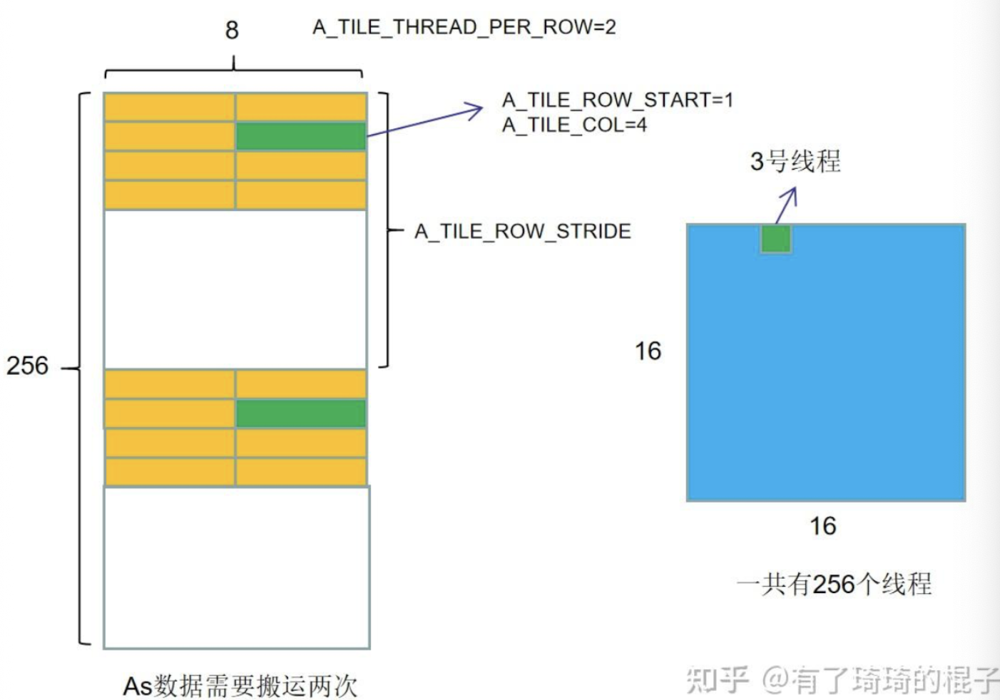
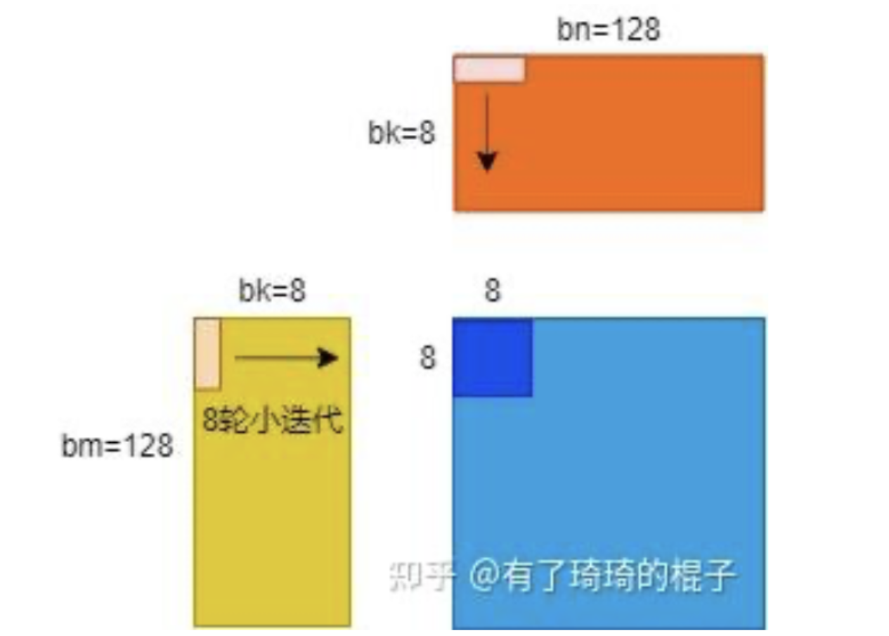
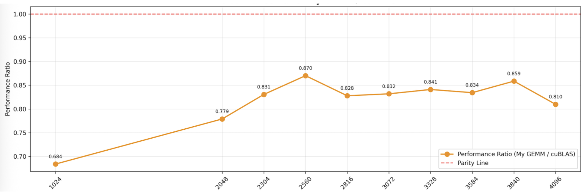

# GEMM优化笔记

### 明确参数：

A, B, C维度均为2048\*2048。

$b_m$ = $b_n$ = 128, $b_k$ = 8, $r_m$ = $r_n$ = 8

则需要开启$\frac{2048}{128}*\frac{2048}{128} = 256$ 个block

 每个block包含$\frac{128}{8}*\frac{128}{8} = 256$个线程

每个线程负责计算8*8=64个元素的结果

每个block负责256*64 = 16384个元素的结果

### 不采用数据预取：

针对一个大坐标为(m,n)block (size=128\*128)的计算：

它需要A(size=2048\*2048)的（m,）,B(size=2048\*2048)的(,n)，一共需要进行2048/8=256次迭代（大迭代）。每次迭代需要取A中的128\*8个元素，B中的8\*128个元素到shared memory中。这个block中的256个线程把结果计算出来。

针对一个block的一次大迭代的计算：

shared memory中有128\*8个A矩阵元素和8\*128个B矩阵元素。每个线程负责一个8\*8的小块，每个线程需要进行8次迭代（小迭代）。A中的8\*8坐标下的大坐标和B中的8\*8坐标下的大坐标相乘得到C中的对应坐标。比如说，针对于k=8的特殊情况，A中的(0,0)\*B中的(0,0)块得到C中的(0,0)块，A中的(0,0)\*B中的(0,1)块得到C中的(0,1)块

针对一个8\*8blcok：

使用矩阵外积视角，每次小迭代取A矩阵当前小块的一列(8,1)和B矩阵当前小块的一行(1,8)，然后不断迭代，一共迭代8\*8次，也就是64条FFMA指令，最终得到C中对应小块的结果。

### 采用数据预取：

**主要区别：** 开启的shared memory和寄存器数量有区别（两倍）；需要将一些数据提前放置到shared memory和寄存器中。

**名词定义：** read SM write SM用于读写的两块shared memory；read REG write REG用于读写的两块寄存器

每次先把下一轮大迭代要用到的数据存到write SM中，下一轮小迭代要用到的数据存到write REG中。上一轮大迭代的write SM就是这一轮迭代的read SM，上一轮大迭代的write REG就是这一轮迭代的read REG。

由于从global memory中取数所需的clock cycle非常多，我们在数据取回的同时也对read SM中的数据进行计算。在我们等待的同时，需要开启8次小迭代进行计算。而在小迭代内部也存在读写分离，在对read REG进行计算之前，需要先执行write REG操作。

### 代码详解

#### 模版参数

BLOCK_SIZE_M:128

BLOCK_SIZE_N;8

BLOCK_SIZE_N:128

THREAD_SIZE_Y:8

THREAD_SIZE_X:8

其中tx ty是按照cuda基本设置定义的，tx代表横向坐标➡️，ty代表纵向坐标⬇️。

THREAD_X_PER_BLOCK=128/8=16

THREAD_Y_PER_BLOCK=128/8=16

THREAD_NUM_PER_BLOCK=16*16=256

tid表示当前线程在这256个线程中的id号

tid = ty * THREAD_X_PER_BLOCK + tx

**As**代表为了存储A矩阵中的数据所需要开启的shared memory，因为每次小迭代中取的是A的一小列，为了加快访存速度，我们对A的128\*8的块进行转置后存储到 $b_m*b_k$的块中，由于有预取设置，我们开启两倍的大小，共需要2\*BLOCK_SIZE_K\*BLOCK_SIZE_M的空间。对于**Bs**，由于我们每次小迭代取B的一小行，因此不需要对B进行转置。共需要2*BLOCK_SIZE_K\*BLOCK_SIZE_N的空间。

**accum**用来临时存储C的计算结果。

**frag_a**用来加载As中的rm个数据，为了数据预取同样开启两倍空间。**frag_b**同理。

**ldg_num_a**是从global memory搬运到shared memory的中转站，一次大迭代需要A中的128\*8个数据，一个block中一共有256个线程，令一个线程一次取4个float数据，则每个线程需要搬运128\*8/(256*4)=1次数据（此处情况比较特殊，如果一个block需要256\*8个数据，则每个线程需要搬运2次）。**这个搬运次数就是ldg_num_a**，为了实现pipeline parallezation，我们一共准备**ldg_a_reg**=ldg_num_a \* 4个寄存器。

在global memory -> shared memory阶段，我们需要搬运128\*8个元素到shared memory中。**A_TILE_THREAD_PER_ROW** 代表搬运一行数据需要几个线程，此处一行8个元素，搬运一行需要2个线程。**A_TILE_ROW_START**代表在这个128\*8的数据块中，当前线程需要搬运的数据段的纵向坐标(y)，**A_TILE_COL**代表当前需要搬运的数据段的横向坐标(x)。

由于128\*8的块只用搬运一次，用不上 **A_TILE_COL**，我们在此使用256\*8的数据块解释上述三个参数的逻辑。 256\* 8的矩阵乘以8\*256的矩阵得到256\*256的矩阵，rm=rn=8，因此一共有16*16个线程。对于(0,2)坐标块，也就是3号线程而言，它需要搬运的是:



**A_TILE_ROW_STRIDE**代表在多次搬运时的行跨度。

具体计算公式为：

A_TILE_ROW_START = tid / A_TILE_PER_ROW;

A_TILE_COL = tid % A_TILE_PER_ROW;

A_TILE_ROW_STRIDE = THREAD_NUM_PER_BLOCK / A_TILE_THREAD_PER_ROW;(也就是说计算出来所有线程一起搬运一次之后可以搬运多少行，这个就是跨度)

#### 具体代码逻辑

```c
#define OFFSET(row, col, ld) ((row) * (ld) + (col))
```

（ld for leading dimension，在行主序的场景中代表的就是每行有几个元素）

##### Prefetch

###### Part 1: global memory -> shared memory

此处需要注意我们要对A的待写块先进行转置再存入。

此处省略了中间的寄存器中转环节global memory ( -> register ) -> shared memory

```c
#pragma unroll
for(int i = 0; i < BLOCK_SIZE_M; i += A_TILE_ROW_STRIDE){
	int ldg_index = i / A_TILE_ROW_STRIDE * 4;
  FETCH_FLOAT4(ldg_a_reg[ldg_index]) = FETCH_FLOAT4(A[OFFSET(BLOCK_SIZE_M * by + A_TILE_ROW_START + i, A_TILE_COL, K)]);
  As[0][A_TILE_COL][A_TILE_ROW_START + i] = ldg_a_reg[ldg_index];
	As[0][A_TILE_COL + 1][A_TILE_ROW_START + i] = ldg_a_reg[ldg_index + 1];
  As[0][A_TILE_COL + 2][A_TILE_ROW_START + i] = ldg_a_reg[ldg_index + 2];
  As[0][A_TILE_COL + 3][A_TILE_ROW_START + i] = ldg_a_reg[ldg_index + 3];
}
#pragma unroll
for(int i = 0; i < BLOCK_SIZE_K; i += B_TILE_ROW_STRIDE){
  FETCH_FLOAT4(Bs[0][B_TILE_ROW_START + i][B_TILE_COL]) = FETCH_FLOAT4(B[OFFSET(B_TILE_ROW_START + i, B_TILE_COL + BLOCK_SIZE_N * bx, N)]);
}
_syncthreads();
```

```c
FETCH_FLOAT4(ldg_a_reg[ldg_index]) = FETCH_FLOAT4(A[OFFSET(
            BLOCK_SIZE_M * by + A_TILE_ROW_START + i, // row
            A_TILE_COL, // col
            K )]);
```

此处的BLOCK_SIZE_M \* by中的by是全局的大坐标对应的横坐标，A_TILE_ROW_START是当前块内小的行坐标，i是STRIDE。

==???== 但有个疑问点：为什么col直接就是A_TILE_COL，不应该同row一样，+ BLOCK_SIZE_K \* bx吗？

==ans==:在完整的代码中应该还有一个外层循环，用于控制k，此处只是第一次迭代的预取，k=0

==需要找完整代码检验==


```c
#pragma unroll
```

CUDA编译器指令，用于循环展开优化。

举例：展开前：

```c
for (int i = 0; i < 4; i++) {
    result += array[i];
}
```

展开后：

```c
result += array[0];
result += array[1]; 
result += array[2];
result += array[3];
```

优势：消除循环开销，提高指令即并行，便于寄存器分配。

limit：仅适用于循环次数少且固定的情况

==try==:在测试中可以尝试注释掉这行语句，比较性能


```c
_syncthreads();
```

CUDA同步屏障函数，确保在同一个线程块中的所有线程都执行到_syncthreads()这个位置，保证在_syncthreads()之前的所有内存操作对其他线程可见


###### Part 2：shared memory -> register

```c
#pragma unroll
for(int thread_y = 0; thread_y < THREAD_SIZE_Y; thread_y += 4){
	FETCH_FLOAT4(frag_a[0][thread_y]) = FETCH_FLOAT4(As[0][0][THREAD_SIZE_Y * ty + thread_y]);
}
#pragma unroll
for(int thread_x = 0; thread_x < THREAD_SIZE_X; thread_x += 4){
	FETCH_FLOAT4(frag_b[0][thread_x]) = FETCH_FLOAT4(Bs[0][0][THREAD_SIZE_X * tx + thread_x]);
}
```

同样的，记住tx, ty都是全局大坐标，而且由于此处是从shared  memory -> register，因此对于A矩阵不需要考虑横向的 block 偏移，对于B矩阵不需要考虑纵向的 block 偏移。我们每次搬的是一个长度为4的小条，完成这个for循环才是搬了一个长度为8的单元条。



##### 大迭代逻辑

**write_stage_idx**如果=1，则对As[1]空间进行写操作，对As[0]空间进行读操作。

**tile_idx**表示在大迭代时，在A矩阵的列号。


每次大迭代要读BLOCK_SIZE_K列，直到完成大迭代，也就是tile_idx=K为止。

**load_stage_idx**和write_stage_idx对应，二者保持二进制位相反即可

```c
int wirte_stage_idx = 1;
int tile_idx = 0;
do{
	tile_idx += BLOCK_SIZE_K;
	int load_stage_idx = write_stage_idx ^ 1;
	if(tile_idx < K){
		write_stage_idx ^= 1;
	}
}while(tile_idx < K);
```

**大迭代详解**：

```c
tile_idx += BLOCK_SIZE_K;
if(tile_idx < K){
  #pragma unroll
  for(int i = 0; i < BLOCK_SIZE_M; i += A_TILE_ROW_STRIDE){
    int ldg_index = i / A_TILE_ROW_STRIDE * 4;
    FETCH_FLOAT4(ldg_a_reg[ldg_index]) = FETCH_FLOAT4(A[OFFSET(BLOCK_SIZE_M * by + A_TILE_ROW_START + i, A_TILE_COL + tile_idx, K)]);
  }
  #pragma unroll
  for(int i = 0; i < BLOCK_SIZE_K; i += B_TILE_ROW_STRIDE){
    int ldg_index = i / B_TILE_ROW_STRIDE * 4;
    FETCH_FLOAT4(ldg_b_reg[ldg_index]) = FETCH_FLOAT4(B[OFFSET(tile_idx + B_TILE_ROW_START + i, B_TILE_COL + BLOCK_SIZE_N * bx, N)]);
  }
}
```

==???==没太明白索引计算逻辑


随后进入小迭代计算逻辑中，load_stage_idx表示需要从As的哪个空间进行读数。然后是 **BLOCK_SIZE_K-1**次小迭代。本例中就是7次小迭代。在对 shared memory进行访存的同时计算THREAD_SIZE_X \* THREAD_SIZE_Y个C矩阵元素的结果。

```c
int load_stage_idx = write_stage_idx ^ 1;
#pragmatism unroll
for(int j = 0; j < BLOCK_SIZE_K - 1; ++j){
  #pragma unroll
  for(int thread_y = 0; thread_y < THREAD_SIZE_Y; thread_y += 4){
    FETCH_FLOAT4(frag_a[(j + 1) % 2][thread_y]) = FETCH_FLOAT_4(As[load_stage_idx][j + 1][THREAD_SIZE_Y * ty + thread_y])
  }
  #pragma unroll
  for(int thread_x = 0; thread_x < THREAD_SIZE_X; thread_x += 4){
    FETCH_FLOAT4(frag_b[(j + 1) % 2][thread_x]) = FETCH_FLOAT4(Bs[load_stage_idx][j + 1][THREAD_SIZE_X * tx + thread_x]);
  }
  #pragma unroll
  for(int thread_x = 0; thread_y < THREAD_SIZE_Y; ++thread_y){
    for(int thread_x = 0; thread_x < THREAD_SIZE_Y; ++thread_y){
      accumulation[thread_y][thread_x] += frag_a[j % 2][thread_y] * frag_b[j % 2][thread_x];
    }
  }
}
```

